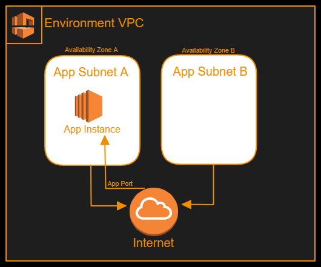
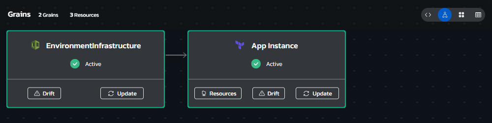
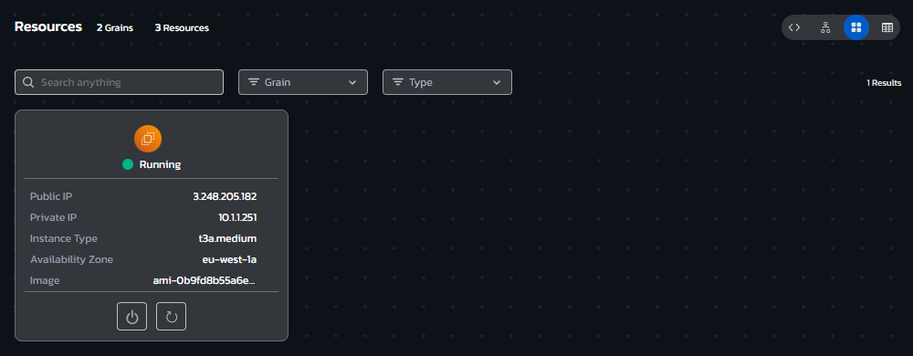
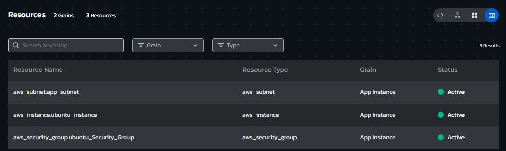

# **Instructions**
## Environment Overview - EC2 Instance from AMI
### This blueprint provisions a standardized cloud application environment, with an EC2 Instance of your choice deployed inside it. 
 

## Environment Architecture

## Environment Screenshots

  

  

  

## Build your own copy 
#### This Environment Blueprint's YAML code can be found in our Torque-Samples repository at [Github.com](https://github.com/QualiTorque/Torque-Samples/blob/main/blueprints/EC2%20Instance%20from%20AMI.yaml) and its underlying IaC components can be found in the [assets folder](https://github.com/QualiTorque/Torque-Samples/blob/main/assets/) of the same repository.

#### The Blueprint is comprised of the following grains:
| Grain Name       | Grain Type       | Grain Contents| Grain Inputs | 
| -----            | ---------        | ----------    | ----------   | 
| Multi Subnet VPC | Nested Blueprint | Reference to a Blueprint that creates a multi-subnet VPC  | AWS Region   | 
| App Instance     | Terraform        | Terraform module that deploys an EC2 instance from an AMI | Subnet ID, AWS Region, SG ID, Keypair Name, Instance Size, Inbound Port, Source AMI   | 

#### and Expects the following user Inputs
| Input Name       | Input Type       | Usage        | 
| -----            | ---------        | ----------   | 
| AWS Region       | Lookup string    | target AWS Region for the deployment | 
| AMI ID           | Lookup string    | AMI from pre-approved list to deploy | 

#### and user Outputs
| Output Name      | Usage                                    | 
| -----            | ----------                               | 
| Instance IP      | the IP of the provisioned EC2 Instance   | 

You are welcome to copy the code of this Blueprint or fork this repository and [connect it to Torque](https://docs.qtorque.io/admin-guide/source-control/source-control-github) in a [new Torque Space](https://docs.qtorque.io/getting-started/Getting%20starting%20with%20terraform) in order to have your own copy of this blueprint which you can run on your own account and modify at will. 

doing so will allow you to: 
- Modify grain inputs/outputs (e.g. change instance size)
- Deploy the Blueprint on your Cloud Account 
- Expose additional Blueprint inputs or outputs 
- customize the description and look and feel of the blueprint in your catalog

