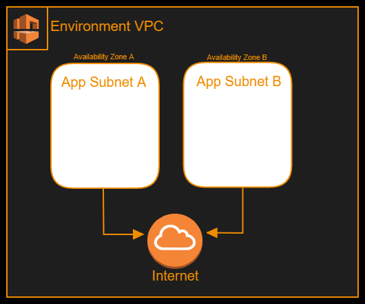
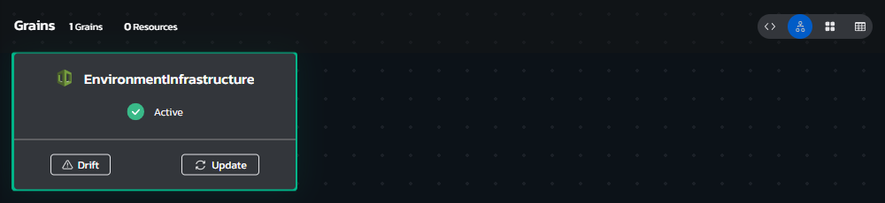

# **Instructions**
## Environment Overview - Multi Subnet VPC
### This blueprint provisions a standardized cloud application environment on AWS, and is designed to be nested within other Blueprints

### The VPC this Blueprint creates contains 2 application subnets in pre-set CIDRS, an internet gateway, a default security group, and a route table with both subnets associated to it. 

### The Blueprint expects an input of the AWS Region from a pre-approved list of regions, and it Outputs the Subnet IDs and Security Group ID from the VPC described Above. 
 

## Environment Architecture

## Environment Screenshots

  

## Build your own copy 
#### This Environment Blueprint's YAML code can be found in our Torque-Samples repository at [Github.com](https://github.com/QualiTorque/Torque-Samples/blob/main/blueprints/Multi%20Subnet%20VPC.yaml) and its underlying IaC components can be found in the [assets folder](https://github.com/QualiTorque/Torque-Samples/blob/main/assets/) of the same repository.

#### The Blueprint is comprised of the following grains:
| Grain Name                | Grain Type       | Grain Contents| Grain Inputs | 
| -----                     | ---------        | ----------    | ----------   | 
| EnvironmentInfrastructure | CloudFormation   | a CFN YAML template for a multi-subnet VPC  | AWS Region   | 

#### and Expects the following user Inputs
| Input Name       | Input Type       | Usage        | 
| -----            | ---------        | ----------   | 
| AWS Region       | Lookup string    | target AWS Region for the deployment | 

#### and user Outputs
| Output Name               | Usage                                    | 
| -----                     | ----------                               | 
| app_subnet_a_id           | The Subnet ID of Application Subnet A    | 
| app_subnet_b_id           | The Subnet ID of Application Subnet B    | 
| default_security_group_id | The Security Group ID of the default SG  | 

You are welcome to copy the code of this Blueprint or fork this repository and [connect it to Torque](https://docs.qtorque.io/admin-guide/source-control/source-control-github) in a [new Torque Space](https://docs.qtorque.io/getting-started/Getting%20starting%20with%20terraform) in order to have your own copy of this blueprint which you can run on your own account and modify at will. 

doing so will allow you to: 
- Modify grain inputs/outputs (e.g. change AWS Region)
- Deploy the Blueprint on your Cloud Account 
- Expose additional Blueprint inputs or outputs 
- customize the description and look and feel of the blueprint in your catalog

