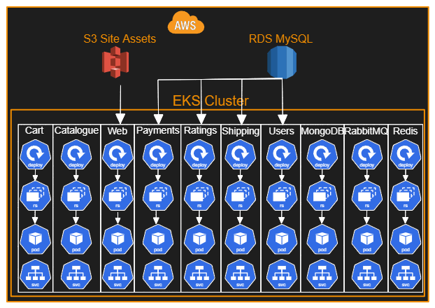
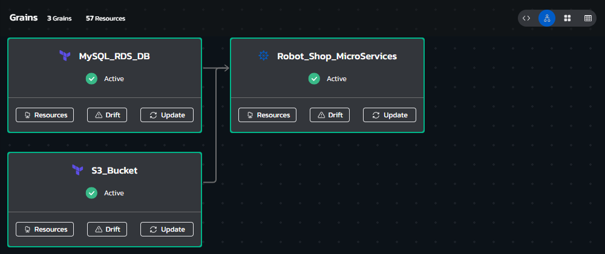
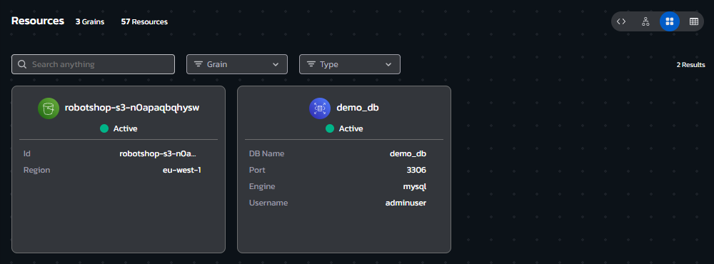
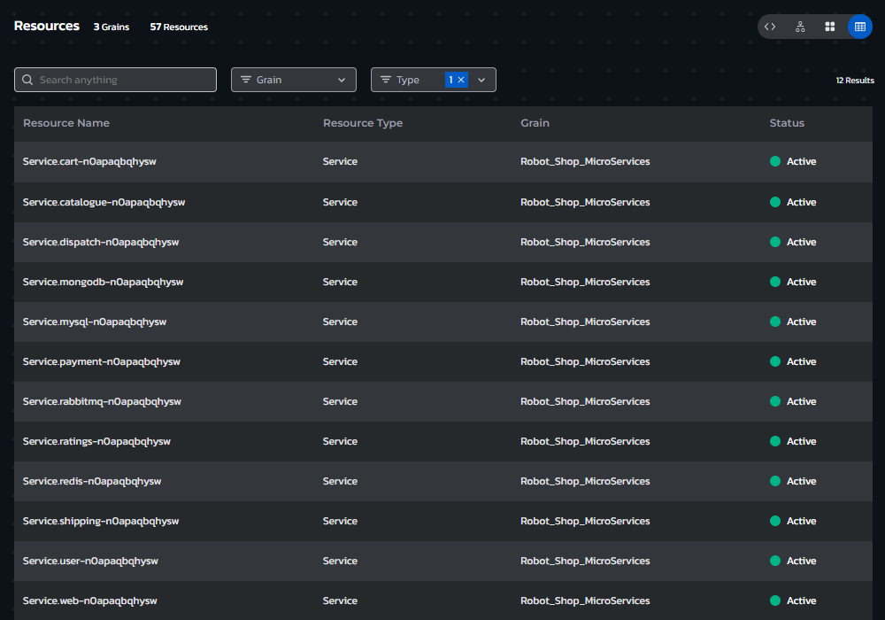

# **Instructions**
## Environment Overview - RobotShop MicroServices Application
### This blueprint provisions a Web eCommerce application "Stan's Robot Shop". 

### This application features multiple Kubernetes based Micro Services, including but not limited to:
- **Shopping Cart Service**
- **Shop Catalogue Service**
- **Payments Service**
- **Ratings Service**
- **Shipping Service**
- **User Management Service**
- **Web Frontend Service**
- **MongoDB Database**
- **RabbitMQ Queuing service**
- **Redis Caching DB**
- **S3 Based Site Content Bucket**
- **RDS Based MySQL Database**

### 2 of these services, the S3 content bucket and the RDS DB, are provisioned separately via Terraform deployment prior to the deployment of the application via Helm, and their details are provided to the application's deployment Helm chart
 

## Environment Architecture

## Environment Screenshots

  

  

  

## Build your own copy 
#### This Environment Blueprint's YAML code can be found in our Torque-Samples repository at [Github.com](https://github.com/QualiTorque/Torque-Samples/blob/main/blueprints/Robot%20Shop%20MicroSVC%20App.yaml) and its underlying IaC components can be found in the [assets folder](https://github.com/QualiTorque/Torque-Samples/blob/main/assets/) of the same repository.

#### The Blueprint is comprised of the following grains:
| Grain Name               | Grain Type  | Grain Contents                  | Grain Inputs | 
| -----                    | ---------   | ----------                      | ----------   | 
| S3_Bucket                | Terraform   | Module that deploys S3 Bucket   | region (AWS Region), acl, name (Bucket Name) | 
| MySQL_RDS_DB             | Terraform   | Module that deploys RDS DB      | region, env_id, size, db_size, db_name, engine, engine_version, username   | 
| Robot_Shop_MicroServices | Helm        | Chart to install Robot Shop App | hostname, domain, version, connectionString (to RDS), S3_BucketArn, storageClassName (for redis), EnvironmentID | 

#### and Expects the following user Inputs
| Input Name             | Input Type    | Usage        | 
| -----                  | ---------     | ----------   | 
| Robot Shop App Version | string        | Version of the Robot Shop app to deploy | 
| DB Engine Instance Size| Lookup string | Instance Size for the RDS DB instances  | 
| DB Engine Version      | string        | MySQL Version for RDS DB                | 

#### and user Outputs
| Output Name          | Usage                                  | 
| -----                | ----------                             | 
| Robot Shop Site      | Link to the Robot Shop App             | 
| RDS MySQL DB Hostname| The hostname of the provisioned RDS DB | 

You are welcome to copy the code of this Blueprint or fork this repository and [connect it to Torque](https://docs.qtorque.io/admin-guide/source-control/source-control-github) in a [new Torque Space](https://docs.qtorque.io/getting-started/Getting%20starting%20with%20terraform) in order to have your own copy of this blueprint which you can run on your own account and modify at will. 

doing so will allow you to: 
- Modify grain inputs/outputs (e.g. change AWS Region, customize the deployed app)
- Deploy the Blueprint on your Cloud Account 
- Expose additional Blueprint inputs or outputs 
- customize the description and look and feel of the blueprint in your catalog

