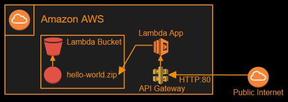
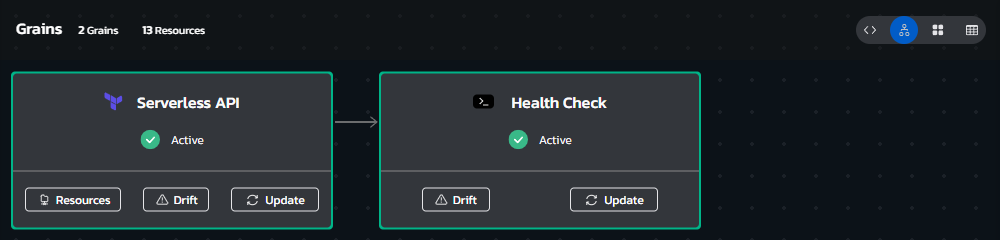
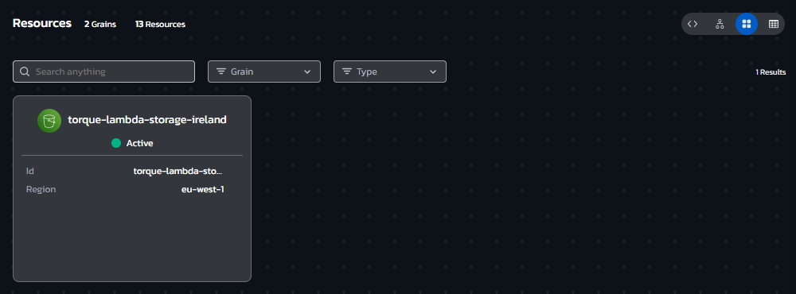
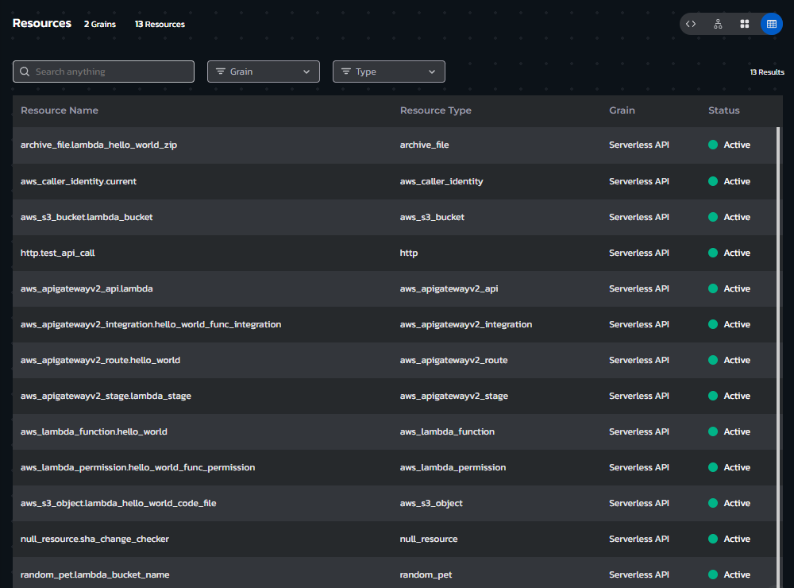

# **Instructions**
## Environment Overview - Serverless App on AWS Lambda
### This blueprint provisions a "Hello World" style serverless app, running on AWS Lambda service with an API Gateway and an S3 storage bucket for storing the application code.

 

## Environment Architecture

## Environment Screenshots
### Environment Grains View (allows updating assets or viewing drift and asset details)

  

### Environment Resource Cards view (allows quick access to Day automation actions like Power On/Off and the ability to run workflows)

  

### Environment Resources List view (clickable list of all deployed resources with their attribute values)

  

## Build your own copy 
#### This Environment Blueprint's YAML code can be found in our Torque-Samples repository at [Github.com](https://github.com/QualiTorque/Torque-Samples/blob/main/blueprints/Serverless%20App%20on%20AWS%20Lambda.yaml) and its underlying IaC components can be found in the [assets folder](https://github.com/QualiTorque/Torque-Samples/blob/main/assets/) of the same repository.

#### The Blueprint is comprised of the following grains:
| Grain Name            | Grain Type       | Grain Contents| Grain Inputs | 
| -----                 | ---------        | ----------    | ----------   | 
| Serverless API | Terraform | A TF module that deploys the serverless app | AWS Region, lamdba_bucket_name, lambda_iam_role   | 
| Health Check   | Shell | a shell script that health checks the deployed app | App URL, Test Input | 

#### and Expects the following user Inputs
| Input Name       | Input Type       | Usage        | 
| -----            | ---------        | ----------   | 
| API Input        | string           | The message to send to the application over the API URL | 

#### and user Outputs
| Output Name            | Usage                                    | 
| -----                  | ----------                               | 
| Serverless API App URL | The URL of the API Gateway endpoint to the App | 
| Test API Call Output   | The output of the Health Check call to the App | 

You are welcome to copy the code of this Blueprint or fork this repository and [connect it to Torque](https://docs.qtorque.io/admin-guide/source-control/source-control-github) in a [new Torque Space](https://docs.qtorque.io/getting-started/Getting%20starting%20with%20terraform) in order to have your own copy of this blueprint which you can run on your own account and modify at will. 

doing so will allow you to: 
- Modify grain inputs/outputs (e.g. change AWS Region)
- Deploy the Blueprint on your Cloud Account 
- Expose additional Blueprint inputs or outputs 
- customize the description and look and feel of the blueprint in your catalog

**Note: this Blueprint relies on a predefined AMI, which contains standard Ubuntu 22.04 customized to turn off firewall and allow root access with credentials, to replicate this Blueprint on your own account, you will need to create an equivalent AMI**

