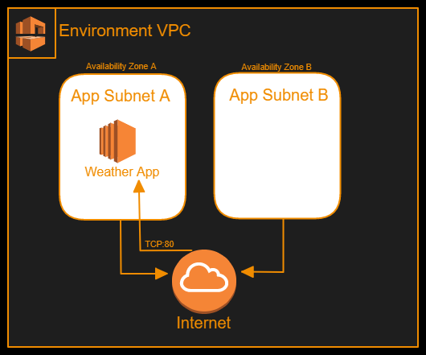
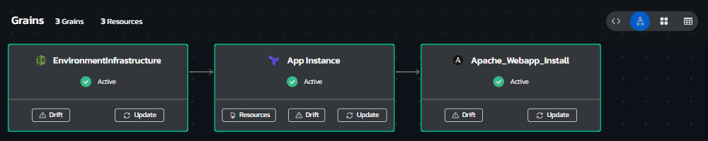
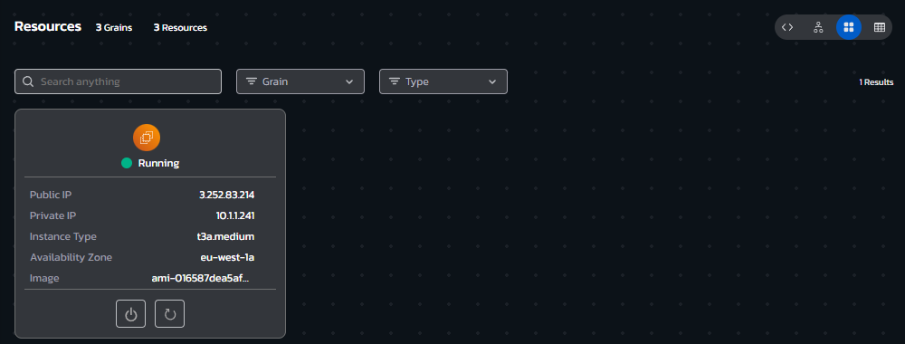
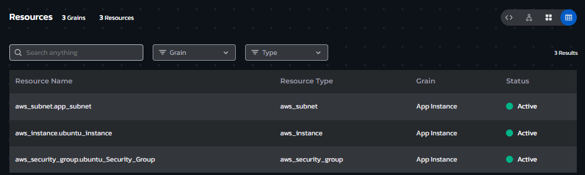
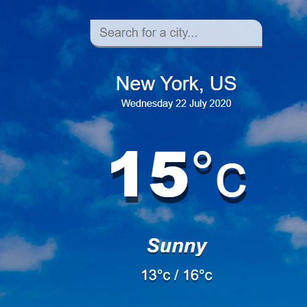
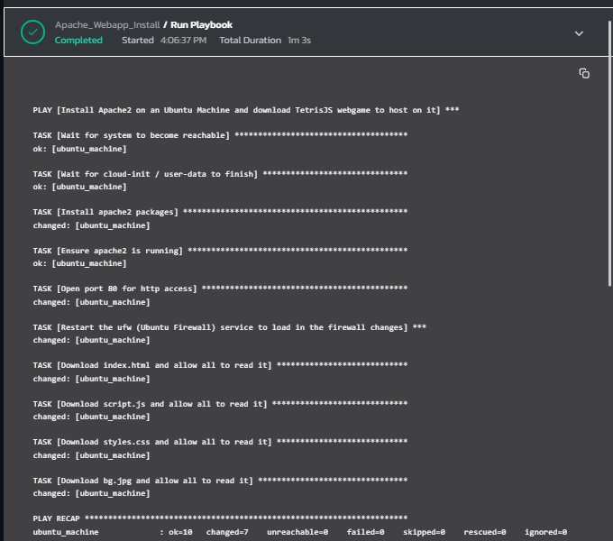

# **Instructions**
## Environment Overview - Weather App on EC2 Web Server
### This blueprint provisions a small EC2-based Web Server running a sample Weather App.

### it utilizes standardized cloud application environment by nesting the Multi_Subnet_VPC blueprint to create the application environment. 

### This enviornment features Ansible configuration management - post AWS EC2 deployment, Torque orchestrates the execution of an Ansible playbook that installs and configures the Web Server and the Weather App on the deployed instance.
 

## Environment Architecture

## Environment Screenshots
### Environment Grains View (allows updating assets or viewing drift and asset details)

  

### Environment Resource Cards view (allows quick access to Day automation actions like Power On/Off and the ability to run workflows)

  

### Environment Resources List view (clickable list of all deployed resources with their attribute values)

  

### Screenshot of the provisioned application

### Screenshot of the Ansible grain playbook log

## Build your own copy 
#### This Environment Blueprint's YAML code can be found in our Torque-Samples repository at [Github.com](https://github.com/QualiTorque/Torque-Samples/blob/main/blueprints/Weather%20App%20on%20EC2%20Web%20Server.yaml) and its underlying IaC components can be found in the [assets folder](https://github.com/QualiTorque/Torque-Samples/blob/main/assets/) of the same repository.

#### The Blueprint is comprised of the following grains:
| Grain Name            | Grain Type       | Grain Contents| Grain Inputs | 
| -----                 | ---------        | ----------    | ----------   | 
| Multi Subnet VPC      | Nested Blueprint | Reference to a Blueprint that creates a multi-subnet VPC  | AWS Region   | 
| App Instance          | Terraform        | Terraform module that deploys an EC2 instance from an AMI (hardcoded with the correct AMI) | Subnet ID, AWS Region, SG ID, Keypair Name, Instance Size, Inbound Port, Source AMI   | 
| Apache_Webapp_Install | Ansible          | Ansible playbook that installs Apache Web server and downloads web app to it | Target host details (host address, user, password), Ansible config flags|

#### and Expects the following user Inputs
| Input Name       | Input Type       | Usage        | 
| -----            | ---------        | ----------   | 
| AWS Region       | Lookup string    | target AWS Region for the deployment | 

#### and user Outputs
| Output Name      | Usage                                    | 
| -----            | ----------                               | 
| Web Server IP    | the IP of the provisioned EC2 Instance   | 
| Web App Link     | Link to the Weather App website deployed | 

You are welcome to copy the code of this Blueprint or fork this repository and [connect it to Torque](https://docs.qtorque.io/admin-guide/source-control/source-control-github) in a [new Torque Space](https://docs.qtorque.io/getting-started/Getting%20starting%20with%20terraform) in order to have your own copy of this blueprint which you can run on your own account and modify at will. 

doing so will allow you to: 
- Modify grain inputs/outputs (e.g. change AWS Region)
- Deploy the Blueprint on your Cloud Account 
- Expose additional Blueprint inputs or outputs 
- customize the description and look and feel of the blueprint in your catalog

**Note: this Blueprint relies on a predefined AMI, which contains standard Ubuntu 22.04 customized to turn off firewall and allow root access with credentials, to replicate this Blueprint on your own account, you will need to create an equivalent AMI**

