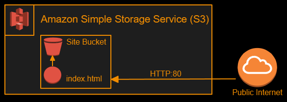
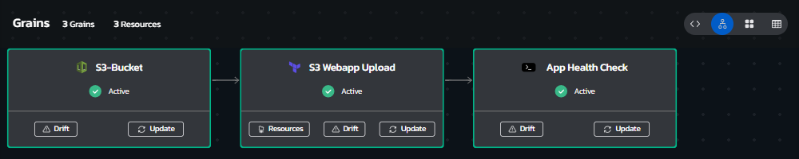
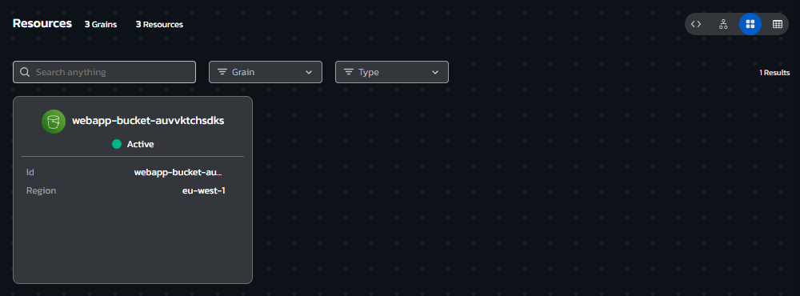
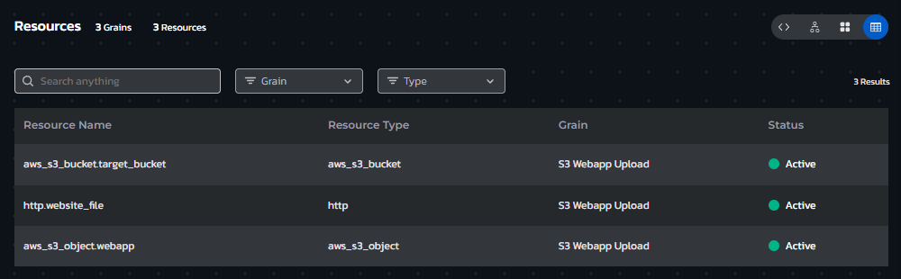
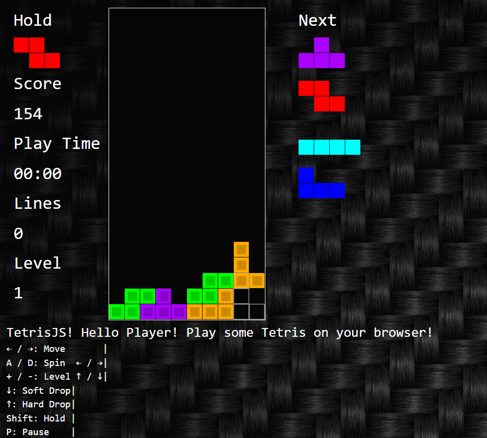

# **Instructions**
## Environment Overview - Webgame on S3
### This blueprint provisions a static Webgame website (TetrisJS), stored on S3 and using S3 to serve the website with no backing compute server.

### Additionally, post deployment the environment executes a healthcheck using a simple shell script grain
 

## Environment Architecture

## Environment Screenshots
### Environment Grains View (allows updating assets or viewing drift and asset details)

  

### Environment Resource Cards view (allows quick access to Day automation actions like Power On/Off and the ability to run workflows)

  

### Environment Resources List view (clickable list of all deployed resources with their attribute values)

  

### Wordpress Website

  

## Build your own copy 
#### This Environment Blueprint's YAML code can be found in our Torque-Samples repository at [Github.com](https://github.com/QualiTorque/Torque-Samples/blob/main/blueprints/Webgame%20on%20S3.yaml) and its underlying IaC components can be found in the [assets folder](https://github.com/QualiTorque/Torque-Samples/blob/main/assets/) of the same repository.

#### The Blueprint is comprised of the following grains:
| Grain Name       | Grain Type       | Grain Contents| Grain Inputs | 
| -----            | ---------        | ----------    | ----------   | 
| S3-Bucket | CloudFormation | a CFN Template that creates an S3 Bucket | AWS Region, Bucket Name, Bucket Access Control | 
| S3 Webgame Uploda   | Terraform | Terraform module uploads the site content to the S3 Bucket | AWS Region, Bucket Name   | 
| App Health Check    | Shell | Shellscript to test the website deployment | Site URL | 

#### and Expects the following user Inputs
| Input Name       | Input Type       | Usage        | 
| -----            | ---------        | ----------   | 
| Bucket Name      | String           | Name of the S3 bucket to provision (will be suffixed with env-id) | 
| Access Control   | Lookup String    | Access control settings for the website (leave at PublicRead or PublicReadWrite to be able to access the web game) | 
| AWS Region       | Lookup string    | target AWS Region for the deployment | 

#### and user Outputs
| Output Name      | Usage                                         | 
| -----            | ----------                                    | 
| Webgame Link     | Link to the provisioned TetrisJS Web Game     | 

You are welcome to copy the code of this Blueprint or fork this repository and [connect it to Torque](https://docs.qtorque.io/admin-guide/source-control/source-control-github) in a [new Torque Space](https://docs.qtorque.io/getting-started/Getting%20starting%20with%20terraform) in order to have your own copy of this blueprint which you can run on your own account and modify at will. 

doing so will allow you to: 
- Modify grain inputs/outputs (e.g. change AWS Region )
- Deploy the Blueprint on your Cloud Account 
- Expose additional Blueprint inputs or outputs 
- customize the description and look and feel of the blueprint in your catalog

