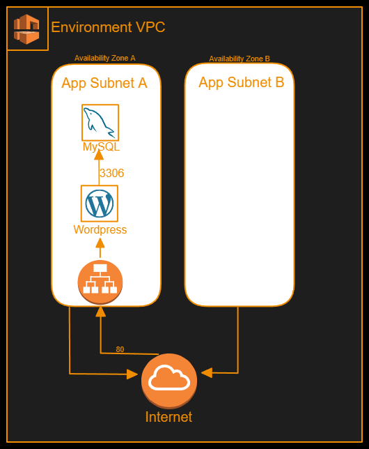
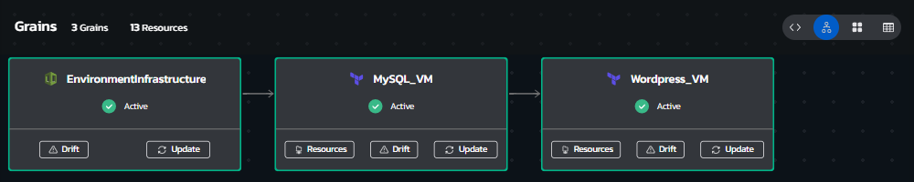
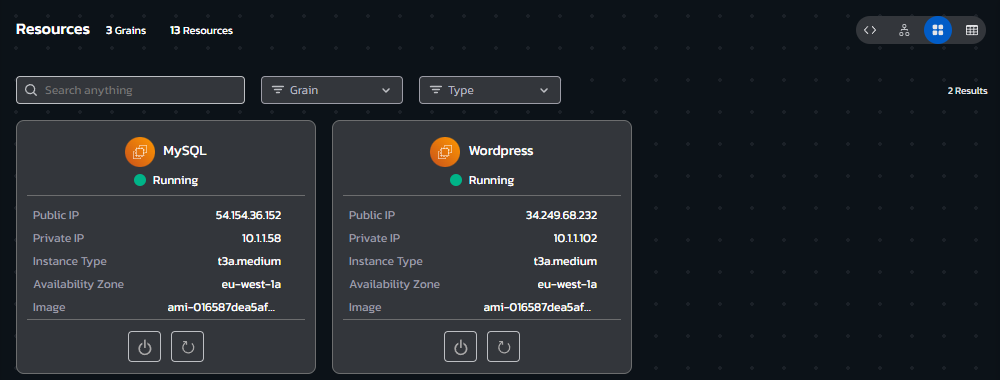
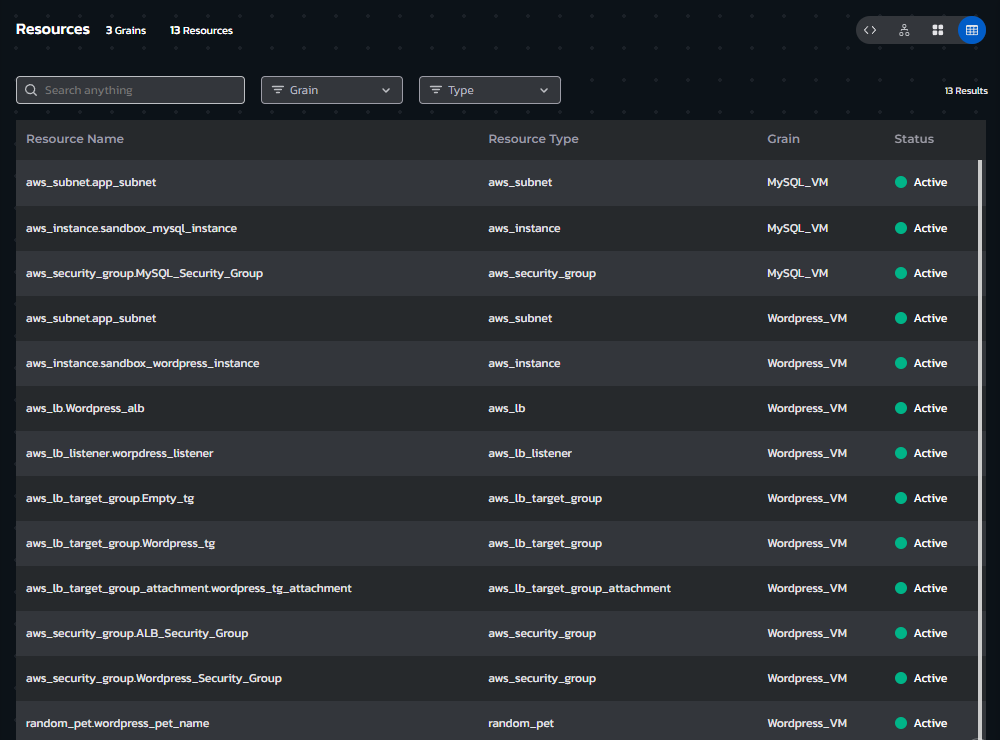
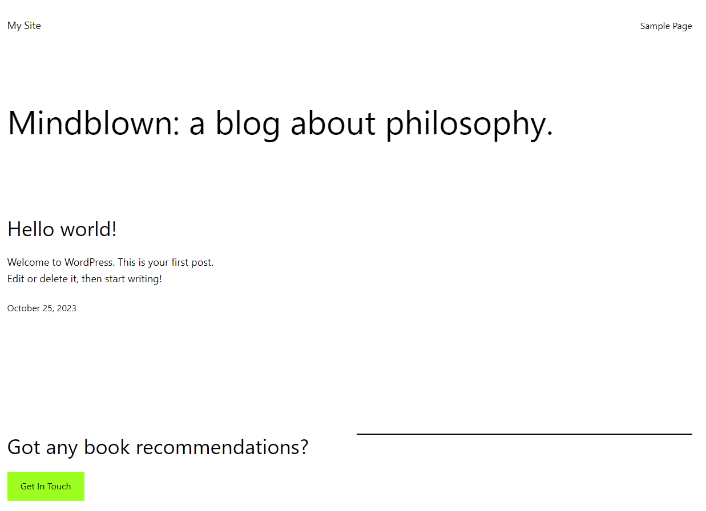

# **Instructions**
## Environment Overview - Wordpress Website on AWS EC2
### This blueprint provisions a a wordpress website, deployed on a standardized cloud application environment.

### The ingress traffic to the Wordpress website is funneled through an Application Load Balancer (ALB)
 

## Environment Architecture

## Environment Screenshots
### Environment Grains View (allows updating assets or viewing drift and asset details)

  

### Environment Resource Cards view (allows quick access to Day automation actions like Power On/Off and the ability to run workflows)

  

### Environment Resources List view (clickable list of all deployed resources with their attribute values)

  

### Wordpress Website

  

## Build your own copy 
#### This Environment Blueprint's YAML code can be found in our Torque-Samples repository at [Github.com](https://github.com/QualiTorque/Torque-Samples/blob/main/blueprints/Wordpress%20Website%20on%20AWS%20EC2.yaml) and its underlying IaC components can be found in the [assets folder](https://github.com/QualiTorque/Torque-Samples/blob/main/assets/) of the same repository.

#### The Blueprint is comprised of the following grains:
| Grain Name       | Grain Type       | Grain Contents| Grain Inputs | 
| -----            | ---------        | ----------    | ----------   | 
| Multi Subnet VPC | Nested Blueprint | Reference to a Blueprint that creates a multi-subnet VPC  | AWS Region   | 
| MySQL_VM     | Terraform        | Terraform module that deploys an EC2 based MySQL DB | Subnet ID, AWS Region, SG ID, Keypair Name, Instance Size, DB Credentials   | 
| Wordpress_VM     | Terraform        | Terraform module that deploys an EC2 based Wordpress website with accompanying infrastructure | Subnet ID, AWS Region, SG ID, Keypair Name, Instance Size, DB Credentials   | 

#### and Expects the following user Inputs
| Input Name       | Input Type       | Usage        | 
| -----            | ---------        | ----------   | 
| DB_NAME          | String           | logical name of DB to create on MySQL| 
| DB_PASS          | String           | Password to configure for MySQL DB   | 
| DB_USER          | String           | Username to configure for MySQL DB   | 
| AWS Region       | Lookup string    | target AWS Region for the deployment | 

#### and user Outputs
| Output Name      | Usage                                         | 
| -----            | ----------                                    | 
| MySQL IP         | the IP of the provisioned MySQL DB Instance   | 
| Wordpress Website| Link to the provisioned Wordpress Website     | 
| Wordpress IP     | the IP of the provisioned Wordpress Instance  | 

You are welcome to copy the code of this Blueprint or fork this repository and [connect it to Torque](https://docs.qtorque.io/admin-guide/source-control/source-control-github) in a [new Torque Space](https://docs.qtorque.io/getting-started/Getting%20starting%20with%20terraform) in order to have your own copy of this blueprint which you can run on your own account and modify at will. 

doing so will allow you to: 
- Modify grain inputs/outputs (e.g. change instance size)
- Deploy the Blueprint on your Cloud Account 
- Expose additional Blueprint inputs or outputs 
- customize the description and look and feel of the blueprint in your catalog

